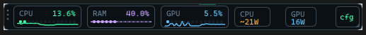
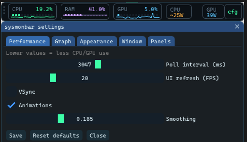
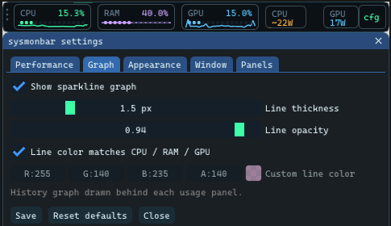
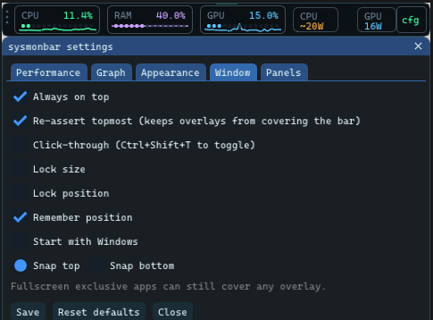

# sysmonbar

A thin always-on-top CPU / RAM / GPU strip for **Windows 10 and 11**.



Linux and macOS already ship usable system monitors. Windows does not give you a small, always-visible bar without opening Task Manager. That is why this exists.





**License:** [MIT](LICENSE). 

This is a **Windows** app (Win32 PDH + GLFW + Dear ImGui). It is not a Linux `/proc` monitor. On Kali/Parrot use `btop`, `htop`, or `conky` instead.

---

## What it does

- Live CPU, RAM, and GPU usage with optional power chips
- Frameless bar you can drag, resize, and snap to the top or bottom
- Opacity, colors, poll rate, and which panels are visible
- Sparkline graph on each panel: on/off, thickness, opacity, color (match the panel or pick one)
- Always-on-top, with an option to re-assert topmost so other windows are less likely to cover it
- Optional click-through, lock size/position, remember position, start with Windows

Settings live in `%LOCALAPPDATA%\sysmonbar\settings.ini`.

---

## Build (Windows)

Needs CMake 3.16+, Visual Studio 2022 (or another MSVC toolchain), and Git (CMake fetches GLFW and Dear ImGui).

```bat
cd sysmonbar
cmake -S . -B build -DCMAKE_BUILD_TYPE=Release
cmake --build build --config Release
build\Release\sysmonbar.exe
```

---

## Controls

| Action | Result |
|--------|--------|
| Drag the left grip | Move the bar |
| Drag an edge/corner | Resize (unless size is locked) |
| **cfg** button or right-click → Settings | Options |
| Ctrl+Q | Quit |
| Ctrl+Shift+T | Toggle click-through |

### Window options

| Option | What it does |
|--------|----------------|
| Always on top | `HWND_TOPMOST` |
| Re-assert topmost | Re-applies topmost about every 1.5s so other overlays are less likely to cover it |
| Click-through | Mouse clicks pass through the bar (use the hotkey to get the mouse back) |
| Lock size / position | Ignore resize or drag |
| Remember position | Restore X/Y on next launch |
| Start with Windows | HKCU Run key |
| Opacity | Native window opacity (not just the ImGui fade) |
| Graph tab | Sparkline on/off, line thickness, opacity, custom color |

Exclusive-fullscreen games can still cover any overlay. That is an OS limit, not a bug in the bar.

---

## Layout

```
├── README.md
├── screenshots/
└── sysmonbar/
    ├── CMakeLists.txt
    ├── LICENSE
    └── src/
        ├── main.cpp       window, UI, topmost / opacity
        ├── settings.cpp   %LOCALAPPDATA%\sysmonbar\settings.ini
        └── sysmon.cpp     PDH / NVML collectors
```
